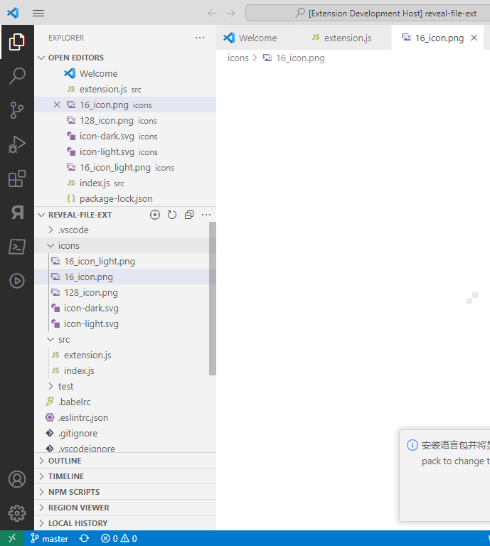

# focus-edit-file-explorer README

<a href="vscode:extension/DK189.vscode-files-explorer" style=" position: relative; font-family: 'Segoe UI', 'Segoe UI Web (West European)', 'Segoe UI', -apple-system, BlinkMacSystemFont, Roboto, 'Helvetica Neue', sans-serif; -webkit-font-smoothing: antialiased; font-size: 14px; font-weight: 400; box-sizing: border-box; display: inline-block; text-align: center; cursor: pointer; vertical-align: top; padding-top: 0px; padding-right: 16px; padding-bottom: 0px; padding-left: 16px; height: 32px; user-select: none; outline: transparent; text-decoration: none; border-radius: 0px; background-color: #107c10; color: #FFFFFF; min-width: 120px; border: 1px solid #666666; line-height: 30px;" >Install to your VSCode</a>
<a href="https://marketplace.visualstudio.com/items?itemName=DK189.vscode-files-explorer" style=" position: relative; font-family: 'Segoe UI', 'Segoe UI Web (West European)', 'Segoe UI', -apple-system, BlinkMacSystemFont, Roboto, 'Helvetica Neue', sans-serif; -webkit-font-smoothing: antialiased; font-size: 14px; font-weight: 400; box-sizing: border-box; display: inline-block; text-align: center; cursor: pointer; vertical-align: top; padding-top: 0px; padding-right: 16px; padding-bottom: 0px; padding-left: 16px; height: 32px; user-select: none; outline: transparent; text-decoration: none; border-radius: 0px; background-color: #9c27b0; color: #FFFFFF; min-width: 120px; border: 1px solid #666666; line-height: 30px;" >See on Marketplace</a>

## Features

\+ Explorer View Extend: Focus edit file in explorer **(Listview)**

**Enjoy!**